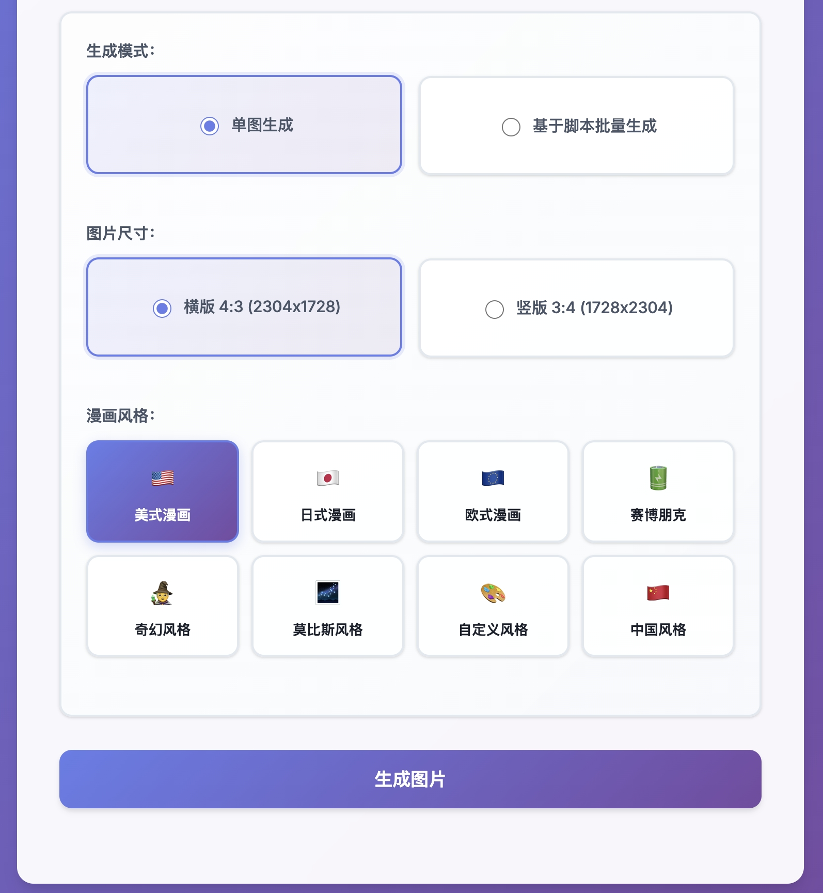

# 🎨 EasyDraw - 智能漫画创作平台

[](LICENSE)
[](https://nodejs.org/)
[](https://expressjs.com/)
[](https://www.doubao.com/)

一个基于豆包AI的完整漫画创作平台，集成分镜头脚本生成和图片生成功能。从故事概念到完整漫画，提供一站式的AI驱动创作体验，支持多种漫画风格和专业的分镜布局。

## 📸 项目展示

### 主界面 - 图片生成器


### 分镜头脚本生成器


### 批量生成与进度显示


### 生成结果展示


## ✨ 功能特性

### 🎬 分镜头脚本生成器
- 📝 **AI驱动脚本创作** - 基于豆包AI的智能分镜脚本生成
- 🎭 **专业漫画结构** - 自动生成封面 + 10个分镜的完整漫画结构
- 📐 **智能分格布局** - 支持1-4格的多样化分镜布局
- 💬 **对话与描述** - 为每个分格生成详细的视觉描述和对话内容
- 📊 **实时生成过程** - 流式输出显示AI创作过程
- 💾 **JSON格式导出** - 标准化脚本格式，可直接用于图片生成
- ⌨️ **快捷键支持** - Ctrl+Enter生成，Ctrl+S保存

### 🎨 图片生成器
- 🎨 **多种漫画风格** - 基于豆包AI Seedream 4.0模型
  - 🇺🇸 美式漫画风格
  - 🇯🇵 日式漫画风格  
  - 🇪🇺 欧式漫画风格
  - 🇨🇳 中国风格（水墨渲染、传统国画技法）
  - 🔮 赛博朋克风格
  - 🧙‍♂️ 奇幻风格
  - 🎨 莫比斯风格
  - 🛠️ 自定义风格
- 🖼️ **多种图片尺寸** - 支持4:3 (2304x1728) 和 3:4 (1728x2304) 比例
- 📚 **单图生成** - 快速生成单张图片，支持实时预览
- 🔄 **批量生成** - 支持故事分镜批量生成，实时进度显示
- 📄 **PDF导出** - 将生成的图片批量导出为PDF文档

### 🔗 用户体验
- 🧭 **智能导航** - 脚本生成器与图片生成器之间的无缝切换
- 📱 **响应式设计** - 完美支持桌面端和移动端
- ⚡ **统一进度效果** - 单图和批量生成具有一致的等待动画
- 🎯 **现代化UI** - 玻璃态效果和平滑动画
- 🔄 **完整工作流** - 从故事概念到成品漫画的一站式创作体验

## 🛠️ 技术栈

- **前端**: HTML5, CSS3, JavaScript (ES6+)
- **后端**: Node.js, Express.js
- **AI服务**: 豆包AI Seedream 4.0 模型
- **PDF处理**: PDFKit
- **样式**: 现代化CSS渐变、玻璃态效果和动画

## 🚀 快速开始

### 前置要求

- Node.js 18.0 或更高版本
- 豆包AI API密钥

### 安装步骤

1. **克隆项目**
```bash
git clone git@github.com:Coldplay-now/easydraw.git
cd easydraw
```

2. **安装依赖**
```bash
npm install
```

3. **配置环境变量**
```bash
cp .env.example .env
```

编辑 `.env` 文件，添加你的豆包API密钥：
```env
DOUBAO_API_KEY=你的豆包API密钥
```

4. **启动服务**
```bash
npm start
```

5. **访问应用**
打开浏览器访问 `http://localhost:3000`

## 📖 使用说明

### 🎬 分镜头脚本生成器
1. **访问脚本生成器**
   - 在主页面点击"📝 分镜头脚本生成器"导航链接
   - 或直接访问 `http://localhost:3000/script-generator.html`

2. **创建故事脚本**
   - 在文本框中输入故事概念或情节描述
   - 例如："侦探调查神秘案件"、"孙悟空大闹天宫"等
   - 点击"生成分镜头脚本"按钮

3. **查看生成过程**
   - 实时观看AI创作过程的流式输出
   - 系统会自动生成封面设计和10个分镜
   - 每个分镜包含1-4格的专业布局

4. **下载和使用**
   - 生成完成后点击"下载JSON文件"
   - 将下载的JSON文件用于图片生成器的批量生成功能

### 🎨 图片生成器

#### 单图生成
1. 在主界面输入框中描述你想要生成的图片内容
2. 选择图片尺寸（4:3 或 3:4）和漫画风格
3. 点击"生成图片"按钮
4. 等待图片生成完成并查看结果

#### 批量生成
1. **使用脚本生成器创建的JSON文件**
   - 上传从分镜头脚本生成器下载的JSON文件
   - 或参考`story/`目录中的示例文件

2. **开始批量生成**
   - 选择图片尺寸和漫画风格
   - 点击"批量生成"开始生成所有分镜
   - 实时查看生成进度和结果

3. **导出和保存**
   - 生成完成后可导出为PDF文档
   - 所有图片自动保存在临时目录中

### 🔗 页面导航
- **主页面** → **脚本生成器**：点击"📝 分镜头脚本生成器"
- **脚本生成器** → **主页面**：点击"🎨 返回图片生成器"

## 📁 项目结构

```
easydraw/
├── story/                   # 故事脚本JSON示例文件
│   ├── 孙悟空拉斯维加斯奇遇记.json
│   ├── 美国西部废土牛仔绝处逢生.json
│   ├── 海底奇景_*.json     # AI生成的脚本文件
│   ├── 深海遗墟_废土奇谭_*.json
│   └── ...                 # 更多AI生成的脚本
├── book/                    # 完整漫画作品集
│   ├── 孙悟空拉斯维加斯奇遇记.json
│   ├── 猪八戒勇闯拉斯维加斯.json
│   ├── 绿野仙踪之回到未来.json
│   └── ...                 # 更多完整作品
├── public/                  # 静态资源文件
│   ├── assets/             # 图片等资源
│   │   ├── 1.jpeg          # 项目展示图片
│   │   ├── 2.jpeg          # 项目展示图片
│   │   ├── 3.jpeg          # 项目展示图片
│   │   └── 4.jpeg          # 项目展示图片
│   ├── index.html          # 主页面（图片生成器）
│   ├── script-generator.html # 分镜头脚本生成器页面
│   ├── script.js           # 图片生成器前端逻辑
│   ├── script-generator.js # 脚本生成器前端逻辑
│   └── style.css           # 统一样式文件
├── system_prompts/          # AI系统提示词目录
│   ├── ScriptDirector.md   # 分镜头脚本生成提示词
│   ├── comic_american.md   # 美式漫画风格提示词
│   ├── comic_chinese.md    # 中国风格提示词
│   ├── comic_japanese.md   # 日式漫画风格提示词
│   └── ...                 # 其他风格提示词
├── temp/                    # 临时文件目录（生成的图片存储在这里）
├── .env.example            # 环境变量示例
├── .gitignore              # Git忽略文件
├── server.js               # Express服务器主文件
├── package.json            # 项目依赖配置
├── system_prompt.md        # 主要AI系统提示词
└── README.md               # 项目说明文档
```

## 🔌 API接口

### 生成分镜头脚本

**POST** `/generate-script-stream`

**请求体**:
```json
{
  "story_concept": "侦探调查神秘案件"
}
```

**响应** (流式输出):
```json
{"type": "progress", "message": "正在分析故事概念..."}
{"type": "chunk", "content": "生成封面设计..."}
{"type": "chunk", "content": "创建分镜1..."}
{"type": "complete", "script_data": {...}, "file_path": "/story/filename.json"}
```

### 生成单张图片

**POST** `/generate-image`

**请求体**:
```json
{
  "prompt": "一个勇敢的牛仔在沙漠中骑马",
  "size": "4:3",
  "style": "美式漫画"
}
```

**响应**:
```json
{
  "success": true,
  "imagePath": "/temp/session-id/timestamp.png",
  "sessionId": "unique-session-id"
}
```

### 批量生成图片

**POST** `/generate-batch`

**请求体**:
```json
{
  "storyData": {
    "story_title": "故事标题",
    "cover": {
      "title": "封面标题",
      "visual_description": "封面描述"
    },
    "panels": [
      {
        "panel_number": 1,
        "layout_type": "2格布局",
        "frames": [
          {
            "frame_number": 1,
            "visual_description": "画面描述",
            "dialogue": "对话内容"
          }
        ]
      }
    ]
  },
  "size": "4:3",
  "style": "美式漫画"
}
```

### 导出PDF

**POST** `/export-pdf`

**请求体**:
```json
{
  "sessionId": "session-id",
  "title": "文档标题"
}
```

## ⚙️ 环境变量

| 变量名 | 描述 | 必填 | 默认值 |
|--------|------|------|--------|
| `DOUBAO_API_KEY` | 豆包AI API密钥 | ✅ | - |
| `PORT` | 服务器端口 | ❌ | 3000 |

## 🎨 特色功能

### 多种漫画风格选择
- **卡片式界面** - 直观的视觉风格选择器
- **8种预设风格** - 覆盖主流漫画艺术风格
- **中国风格特色** - 水墨渲染、传统国画技法、留白意境
- **实时预览** - 点击即可切换风格

### 智能图片尺寸适配
- **4:3 比例** (2304x1728): 适合横向展示的场景
- **3:4 比例** (1728x2304): 适合竖向展示的场景
- PDF导出时自动选择最佳页面方向

### 统一的用户体验
- 单图和批量生成使用相同的加载动画
- 实时进度显示和状态更新
- 一致的视觉反馈和交互体验

### 高效的批量处理
- 支持大量分镜的批量生成
- 实时显示生成进度和统计信息
- 错误处理和重试机制

## 🔧 开发说明

### 自定义样式
项目使用现代化的CSS特性：
- CSS渐变背景和玻璃态效果
- 平滑的动画过渡效果
- 响应式布局设计
- 统一的加载动画组件

### 扩展功能
可以轻松扩展以下功能：
- 添加更多图片尺寸选项
- 支持更多AI模型
- 添加用户账户系统
- 实现图片编辑功能
- 添加历史记录和收藏功能

## 📚 故事脚本示例

项目提供了`story/`目录，包含了预制的故事脚本JSON示例文件，您可以参考这些文件来创建自己的故事：

- **孙悟空拉斯维加斯奇遇记.json** - 经典角色的现代冒险故事
- **美国西部废土牛仔绝处逢生.json** - 西部题材的生存故事

这些示例文件展示了完整的故事结构和分镜描述，可以直接用于批量生成，也可以作为创建自定义故事的参考模板。

### 故事模板格式
```json
{
  "title": "故事标题",
  "description": "故事描述",
  "panels": [
    {
      "panel_number": 1,
      "description": "分镜描述",
      "characters": ["角色列表"],
      "setting": "场景设置"
    }
  ]
}
```

## 🤝 贡献指南

1. Fork 项目
2. 创建特性分支 (`git checkout -b feature/AmazingFeature`)
3. 提交更改 (`git commit -m 'Add some AmazingFeature'`)
4. 推送到分支 (`git push origin feature/AmazingFeature`)
5. 打开 Pull Request

## 📄 许可证

本项目采用 MIT 许可证 - 查看 [LICENSE](LICENSE) 文件了解详情。

## 🆘 支持与反馈

- 🐛 **Bug报告**: [提交Issue](https://github.com/Coldplay-now/easydraw/issues)
- 💡 **功能建议**: [功能请求](https://github.com/Coldplay-now/easydraw/issues)
- 📧 **联系我们**: 通过GitHub Issues联系开发团队

---

⭐ 如果这个项目对你有帮助，请给我们一个星标！